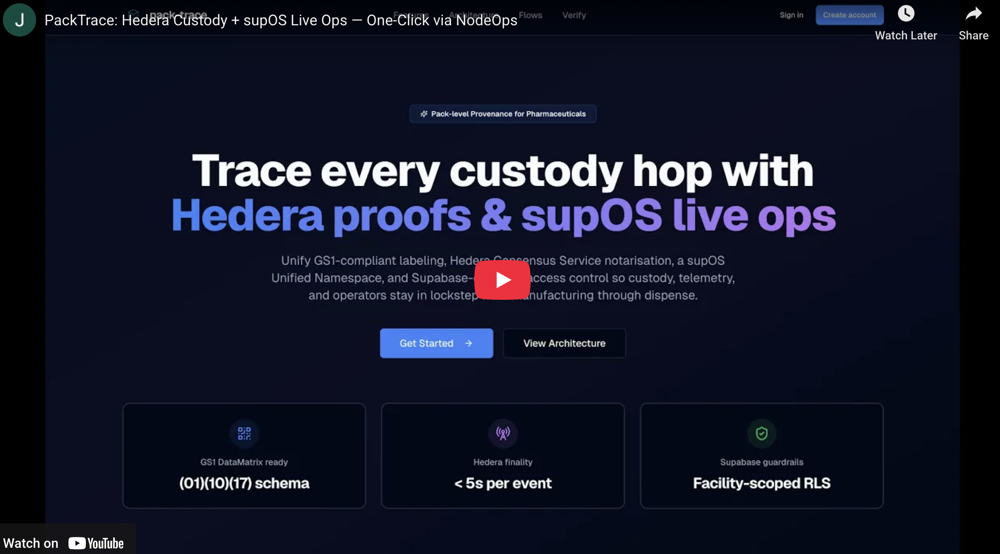

# PackTrace

[](https://www.youtube.com/watch?v=hJAu5NF_61I)

### Hackathon Alignment

- Focus: DLT for Operations — applies Hedera to improve healthcare supply chains with verifiable custody and cold‑chain oversight.
- Impact: Reduces counterfeit risk and spoilage through GS1 labeling, public custody proofs (HCS), and real‑time operational visibility (supOS).
- Accessibility: One‑click NodeOps template and public amd64 image enable fast trials across African cities and online participants.

### Quick Links

| Resource | Link |
| --- | --- |
| Live Website | https://pack-trace.vercel.app/ |
| Pitch Deck | [Canva](https://www.canva.com/design/DAG3XwUtWbQ/gQ-hhHi7xIjtI0EyhLazyg/edit?utm_content=DAG3XwUtWbQ&utm_campaign=designshare&utm_medium=link2&utm_source=sharebutton) |
| Pitch Deck (Detailed Roadmap) | [Canva](https://www.canva.com/design/DAG6WEzcGDE/-23llBmHgdcLuoOQb5hjzw/edit?utm_content=DAG6WEzcGDE&utm_campaign=designshare&utm_medium=link2&utm_source=sharebutton) |
| YouTube Video Demo | https://www.youtube.com/watch?v=hJAu5NF_61I |
| Hashgraph Developer Course Certificate | https://drive.google.com/file/d/10fQnK3CINl5sH9a2s4m0pUzO2I9Lo_QH/view?usp=sharing |
| NodeOps Template URL (For easy deployment) | https://cloud.nodeops.network/marketplace/d42cgfkc6prc7390ivcg |

### Demo Logins (seeded)

Fastest way to test: Use these default seeded credentials to sign in on the Live Website (https://pack-trace.vercel.app/):

- Manufacturer admin – `manufacturer@packtrace.app` / `TraceDemo!24`
- Distributor operator – `distributor@packtrace.app` / `TraceDemo!24`
- Pharmacy technician – `pharmacy@packtrace.app` / `TraceDemo!24`
- Auditor reviewer – `auditor@packtrace.app` / `TraceDemo!24`

## Hedera Integration Summary

### Hedera Consensus Service (HCS)
- Why: Immutable, low-cost logging of critical custody events. Predictable per‑message fees (~$0.0001) ensure operational cost stability for high‑volume, low‑margin logistics.
- How: Backend submits custody payload hashes via `TopicMessageSubmitTransaction`; batch records store the topic ID and references to sequence numbers and running hashes.

### Mirror Node (REST)
- Why: Public, verifiable read path for auditors and UIs without custom indexers.
- How: The app queries Mirror Node REST, decodes base64 payloads, and renders an ordered custody timeline with sequence numbers, consensus timestamps, and HashScan links.

#### Transaction Types
- `TopicCreateTransaction` (one‑time per deployment) to create the custody topic.
- `TopicMessageSubmitTransaction` for each custody event.

#### Economic Justification
- Hedera’s low, predictable fees, high throughput, and ABFT finality make per‑event notarization economically viable and operationally dependable.


## Deployed Hedera IDs (Testnet)
- Operator Account ID: `0.0.7154879`
- HCS Topic ID: `0.0.7163002`
- Smart contracts / HTS tokens: not used in this deployment.


## Deployment & Setup (under 10 minutes)

Quickest test: sign in on the Live Website with the default seeded credentials. But, to deploy or run locally, follow the steps below.

1) Clone and install
- `git clone https://github.com/syntaxsurge/pack-trace && cd pack-trace`
- `pnpm install` (or `npm install`)

2) Configure environment
- Copy `.env.example` to `.env` and fill:
  - `NEXT_PUBLIC_SUPABASE_URL`, `NEXT_PUBLIC_SUPABASE_ANON_KEY` (Supabase → Project Settings → API)
  - `SUPABASE_SERVICE_ROLE_KEY` (server‑only; keep secret)
  - `NEXT_PUBLIC_NETWORK=testnet`
  - `HEDERA_OPERATOR_ACCOUNT_ID`, `HEDERA_OPERATOR_DER_PRIVATE_KEY` (testnet)
  - `HEDERA_TOPIC_ID` (create next or reuse)

3) Create HCS topic on Testnet (one‑time)
- `pnpm tsx -r dotenv/config lib/hedera/examples/topic-create.ts "pack-trace topic"`
- Paste the returned topic ID into `HEDERA_TOPIC_ID`.

4) Run locally (Testnet)
- Dev: `pnpm dev` → `http://localhost:3000`
- Prod: `pnpm build && pnpm start` → `http://localhost:3000`

5) Seed demo data (optional)
- `pnpm seed:demo` (uses `DEMO_SEED_PASSWORD` if set, default `TraceDemo!24`)

6) supOS (optional)
- Start supOS CE, then run `pnpm worker:supos` to stream custody events to MQTT with QoS 1 retries.

### Running Environment
- Frontend: Next.js App Router served at `http://localhost:3000`.
- Backend: Next.js route handlers under `app/api/*` (no separate server). In Docker, the runtime executes `node server.js` (standalone output).


## Architecture

### Architecture Diagram
```
[ Browser (UI) ] --scan/verify--> [ Next.js API /api/verify ]
        |                                   |
        |  custody events (/api/events)     | TopicMessageSubmitTransaction
        v                                   v
   [ Next.js API /api/events ]  ------>  [ Hedera HCS Topic ]
        ^                                   |
        | Mirror Node REST (timeline)       |
        |                                   v
        +--------<--------- [ Mirror Node ]

   [ Supabase (Postgres/RLS) ] <---- Next.js server components
   [ supOS (MQTT/Namespace/Dashboards) ] <--- outbox worker (QoS 1)
```


### Frontend
- Next.js App Router with Tailwind and shadcn/ui primitives.
- Client-side Supabase browser client for auth interactions.
- Dashboard server components query Supabase directly for stats, recent batches, and custody events.

### Backend
- Route handlers under `app/api/*` apply Supabase service role keys when required, including custody event ingestion (`/api/events`) and facility directory queries (`/api/facilities`).
- REST API surface delivers batch creation (`POST /api/batches`), batch snapshots (`GET /api/batches/:id`), DataMatrix label exports (`GET /api/batches/:id/label`), custody timelines (`GET /api/timeline`), verification (`GET /api/verify`), dispensing receipts (`POST /api/dispense`), and traceability reports (`GET /api/report`).
- Supabase auth cookie middleware guards all private routes except `/`, `/login`, and `/auth/*`.
- Hedera helpers in `lib/hedera` wrap the JavaScript SDK for client creation, topic management, message publishing, and Mirror Node reads.

### Operations Bus
- `lib/supos/*` establishes an MQTT publisher that mirrors custody events into the supOS CE broker (default `mqtt://localhost:1883`) with QoS 1 delivery semantics.
- The Supabase trigger `enqueue_supos_outbox` persists every custody event into `supos_outbox`, allowing `npm run worker:supos` to replay messages until the broker acknowledges publication.
- Topics follow a Unified Namespace shape: `trace/events` carries custody transitions, while `trace/sensors/tempC` and `trace/alerts/coldchain` provide optional cold-chain telemetry and summaries for dashboards.
- supOS converts these topics into modeled entities with History enabled so Dashboards can read from the internal TimescaleDB/Postgres store without additional ETL, while `/api/stream/supos` provides live SSE updates for the workspace UI.

### Distributed Ledger
- Hedera Consensus Service topic IDs recorded on `batches.topic_id`.
- Custody events store `hcs_tx_id`, optional `hcs_seq_no`, and `hcs_running_hash` for reconciliation against mirror nodes.


## Hedera credentials & topic setup

1. **Create a Hedera developer account (testnet is free)**
   - Register at [portal.hedera.com/register](https://portal.hedera.com/register) and choose the Testnet environment.
   - Copy the *Account ID* and under **More Details** copy the *DER Encoded Private Key* (the Hex key on the main card will not work).
2. **Populate environment variables**
   ```bash
   NEXT_PUBLIC_NETWORK=testnet
   HEDERA_OPERATOR_ACCOUNT_ID=0.0.xxxxxx      # Account ID from the portal
   HEDERA_OPERATOR_DER_PRIVATE_KEY=302e0201... # DER Encoded Private Key
   HEDERA_TOPIC_ID=0.0.yyyyyy                 # Leave empty until the next step
   ```
3. **Create a topic for custody events**
   ```bash
   pnpm tsx -r dotenv/config lib/hedera/examples/topic-create.ts "pack-trace topic"
   ```
   The script loads `.env` via `dotenv`, creates the topic, and prints an ID like `0.0.987654`. Copy that value into `HEDERA_TOPIC_ID`.
4. **Verify (optional)**
   - Paste the topic ID into [HashScan](https://hashscan.io/testnet) to confirm it exists.
   - Run `pnpm tsx -r dotenv/config lib/hedera/examples/topic-submit.ts 0.0.987654 "hello world"` to publish a test message.
5. **Restart the dev server** so `/scan` and related custody timelines can append and read Hedera messages.


## supOS Integration (real data + Node-RED automation)

This section shows how PackTrace streams real custody data into supOS and uses Event Flow to automate alerts. It includes namespace setup, checkbox rules, and full Node-RED function code.

### 1) Bring supOS CE online

- Clone and install:
  - `cd .. && git clone https://github.com/FREEZONEX/supOS-CE`
  - `cd supOS-CE && vi .env`
    - Set `VOLUMES_PATH` to a writable directory (for example `./runtime` inside the repo).
    - Set `ENTRANCE_DOMAIN` to the host IP you will use in the browser (for example `192.168.1.4`).
  - `bash bin/install.sh` and wait for the login URL (default admin: `supos/supos`).
- Free port 3000 for PackTrace by remapping Grafana:
  - In `docker-compose-4c8g.yml`, change Grafana `ports: ["3000:3000"]` to `["3300:3000"]`.
  - Apply the change: `docker compose -p supos -f docker-compose-4c8g.yml up -d grafana`
- Useful URLs (swap in your supOS host IP as needed):
  - supOS gateway: `http://192.168.1.4:8088/home`
  - Namespace: `http://192.168.1.4:8088/uns`
  - Node-RED (Event Flow editor): `http://192.168.1.4:1889`
  - Grafana (remapped): `http://192.168.1.4:3300`
  - MQTT broker: `mqtt://192.168.1.4:1883`

### 2) Connect PackTrace to supOS (real data bridge)

Add these to `.env` or `.env.local` and restart the app:

```bash
SUPOS_BRIDGE_ENABLED=true
SUPOS_MQTT_URL=mqtt://192.168.1.4:1883   # replace host/IP to match your supOS broker
SUPOS_MQTT_USERNAME=                     # fill only if your broker requires auth
SUPOS_MQTT_PASSWORD=
SUPOS_BRIDGE_QOS=1
SUPOS_CLIENT_ID=packtrace-bridge
SUPOS_BRIDGE_CONCURRENCY=8
SUPOS_BRIDGE_MAX_ATTEMPTS=8
SUPOS_BRIDGE_BASE_DELAY_MS=1000
```

Then:
- Apply the latest DB migrations (includes the `supos_outbox` trigger): `pnpm db:push`
- Start the supOS outbox worker to publish custody events to MQTT with QoS 1 retries: `pnpm worker:supos`
- Run the app: `pnpm dev`

Custody events insert into `supos_outbox` and are drained to `trace/events`. Temperature telemetry comes from supOS Mock Data on `trace/sensors/tempC` or from real devices publishing to that topic.

### 3) Build the Namespace: paths, topics, and checkbox rules

#### 3.1 Create paths (folders)
- In supOS go to **Home → UNS → Namespace** and select **Topic** at the top of the tree.
- Use **Add New Path** to create:
  - `trace`
  - Under `trace`, create `alerts`
  - Under `trace`, create `sensors`


#### 3.2 Checkbox meanings
- **Mock Data**: generates a pre-built Node-RED flow that publishes sample messages to this topic.
- **Generate Dashboard**: creates a Grafana dashboard wired to the topic.
- **Enable History**: stores the topic in TimescaleDB/Postgres with retention/indexing.

Rules for PackTrace:
- Only `trace/sensors/tempC` uses **Mock Data = ON** (so telemetry exists for demos).
- Every topic uses **Generate Dashboard = ON** and **Enable History = ON**.
- All alert and event topics keep **Mock Data = OFF** to reflect real PackTrace data.

#### 3.3 Create topics (per path)

1) `trace/events` (custody stream from PackTrace)
- Right-click `trace/events` → **Create New Topic**.
- Mock Data: OFF; Generate Dashboard: ON; Enable History: ON.
- Use **Reverse Generation** with this sample (matches the Supabase trigger payload):
  ```json
  {
    "v": 1,
    "type": "HANDOVER",
    "batch": {
      "id": "88c551d1-f361-4c22-b293-bf6f7aa349ab",
      "gtin": "09506000134352",
      "lot": "AMX-54E",
      "exp": "2025-11-19"
    },
    "actor": { "facilityId": "3684d565-ec60-49e0-a0d8-011f742fb5cb", "role": "STAFF" },
    "to": { "facilityId": "634fbdf2-69e0-40ee-b3a3-d52f775d71ec" },
    "ts": "2025-10-30T15:34:29.950Z",
    "prev": "sha256:4d7bc3e8be8779af50799141f14af7c291f9ec6822df749f052dc302eb02ebdc",
    "event": {
      "id": "829a8610-c1d9-4e06-903f-88a257842bdc",
      "hcsTxId": "0.0.7154879@1761838644.087622792",
      "hcsSeqNo": 19,
      "hcsRunningHash": "clPbFD0TsvBP+fV5beElPbycwOs40UZ6LbqtsY76NYGXdfcF0CJWq2XRMMMNu/kG",
      "payloadHash": "f3a896d2e4fcc54b4bca54c81014eba8615a6a43c0c92cd181e23d4a68b28fcb"
    }
  }
  ```


2) `trace/sensors/tempC` (temperature telemetry)
- Right-click `trace/sensors` → **Create New Topic**.
- Mock Data: ON; Generate Dashboard: ON; Enable History: ON.
- Reverse Generation example:
  ```json
  { "v": 1, "value": 8.6, "ts": "2025-10-30T15:36:05.120Z", "batchId": "88c551d1-f361-4c22-b293-bf6f7aa349ab" }
  ```


3) `trace/alerts/coldchain`
- Right-click `trace/alerts` → **Create New Topic**.
- Mock Data: OFF; Generate Dashboard: ON; Enable History: ON.
- Reverse Generation example:
  ```json
  {
    "v": 1,
    "kind": "COLDCHAIN_EXCURSION",
    "status": "TOO_HOT",
    "value": 8.7,
    "unit": "C",
    "safeRange": { "min": 2, "max": 8 },
    "sample": { "ts": "2025-10-30T15:30:05.000Z", "value": 8.7 },
    "batchId": "88c551d1-f361-4c22-b293-bf6f7aa349ab",
    "detectedAt": "2025-10-30T15:31:00.000Z"
  }
  ```


4) `trace/alerts/stuck`
- Right-click `trace/alerts` → **Create New Topic**.
- Mock Data: OFF; Generate Dashboard: ON; Enable History: ON.
- Reverse Generation example:
  ```json
  {
    "v": 1,
    "kind": "STUCK_SHIPMENT",
    "batchId": "88c551d1-f361-4c22-b293-bf6f7aa349ab",
    "toFacilityId": "634fbdf2-69e0-40ee-b3a3-d52f775d71ec",
    "minutesOverdue": 14,
    "lastHandoverTs": "2025-10-30T15:34:29.950Z",
    "detectedAt": "2025-10-30T15:49:29.950Z"
  }
  ```


5) `trace/alerts/offline`
- Right-click `trace/alerts` → **Create New Topic**.
- Mock Data: OFF; Generate Dashboard: ON; Enable History: ON.
- Reverse Generation example:
  ```json
  {
    "v": 1,
    "kind": "SENSOR_OFFLINE",
    "deviceId": "facility-123",
    "lastSeen": "2025-10-30T15:20:00.000Z",
    "minutesOffline": 12,
    "thresholdMinutes": 10,
    "detectedAt": "2025-10-30T15:32:00.000Z"
  }
  ```


#### 3.4 Bind data connections for History/Dashboards
- After creating each modeled topic, open it in Namespace, go to **Topology Map**, and open **Data Connection**.
- If prompted, pick the `node-red` template and deploy. This ensures History stays wired to the topic and dashboards can read persisted data.

### 4) Event Flow (Node-RED) – logic and automation

All flows run in supOS **Event Flow (Node-RED)**, subscribe to PackTrace topics, execute JavaScript, and publish alerts back to supOS.

#### 4.0 MQTT defaults (use these for every MQTT node)
- **Server:** `mqtt://192.168.1.4:1883` (swap the IP to your supOS host). In the node dialog, click the pencil, set Server to that URL, leave Client ID blank, and leave Username/Password blank unless you secured the broker.
- **QoS:** `1`
- **MQTT IN → Output:** `auto-detect (parsed JSON object, string or buffer)`
- **MQTT OUT → Retain:** `false`
- All other fields/tabs: defaults.

Topics live on the MQTT OUT nodes; function nodes only set `msg.payload`.

---

#### 4.1 Flow A – `packtrace-stuck` (handover without receipt)

Detects stuck handovers even when no new custody events arrive by separating state tracking and periodic checks.

1) **Create the flow**  
Home → Event Flow → + New Event Flow → Name `packtrace-stuck`, Template `node-red`, Description `Detect stuck shipments from PackTrace custody events`, Save, open.

2) **MQTT IN – `trace-events-in`**
- Action: Subscribe to single topic
- Topic: `trace/events`
- QoS: `1`
- Output: auto-detect (parsed JSON object, string or buffer)
- Name: `trace-events-in`
- Server: `mqtt://192.168.1.4:1883`

3) **Function – `Track handovers`** (updates state only)
- Name: `Track handovers`
- Setup/Start/Stop: empty
- On Message:
```js
/**
 * Track all HANDOVER and RECEIVE events in global state.
 * Does NOT emit alerts. Just keeps handovers and stuckAlerts up to date.
 */

const e = msg.payload || {};

// how long before we call a shipment "stuck" (still used by checker)
const SLA_MINUTES = 1;
const SLA_MS = SLA_MINUTES * 60 * 1000;

const now = Date.now();

// Load state from global context
let handovers   = global.get("handovers")   || {};  // batchId -> { atMs, event }
let stuckAlerts = global.get("stuckAlerts") || {};  // batchId -> true

// Try to read batch id and type from the event
const batchId =
  e.batchId ||
  (e.batch && e.batch.id) ||
  null;

const type = (e.type || "").toUpperCase();

// If this message is a "normal" custody event, update state
if (batchId && type) {
  if (type === "HANDOVER") {
    // Use the event timestamp if provided, else "now"
    const atMs = e.ts ? Date.parse(e.ts) : (e.at ? Date.parse(e.at) : now);

    handovers[batchId] = {
      atMs,
      event: e
    };
  }

  if (type === "RECEIVE" || type === "RECEIVED") {
    // Shipment arrived — clear any pending handover and alert flag
    delete handovers[batchId];
    delete stuckAlerts[batchId];
  }
}

// Save updated state, but do NOT emit alerts here
global.set("handovers", handovers);
global.set("stuckAlerts", stuckAlerts);

return null;
```
- Wire: `trace-events-in` → `Track handovers` (no MQTT out from this node).

4) **Inject – `Check stuck every minute`**
- Payload: timestamp (default)
- Topic: blank
- Repeat: interval every `60` seconds (use `10` seconds for demo if desired)
- Name: `Check stuck every minute`

5) **Function – `Check stuck handovers`** (scans state and emits alerts)
- Name: `Check stuck handovers`
- On Message:
```js
/**
 * Periodically check all pending handovers and emit stuck alerts if any
 * have exceeded the SLA.
 */

const SLA_MINUTES = 1;                // match Track handovers
const SLA_MS = SLA_MINUTES * 60 * 1000;

const now = Date.now();

// Load state
let handovers   = global.get("handovers")   || {};
let stuckAlerts = global.get("stuckAlerts") || {};

const alertsToSend = [];

// Scan all pending handovers
for (const id of Object.keys(handovers)) {
  const pending = handovers[id];
  const ageMs = now - pending.atMs;

  if (ageMs < SLA_MS) {
    continue; // not old enough
  }

  if (stuckAlerts[id]) {
    continue; // already alerted
  }

  stuckAlerts[id] = true;

  const ageMinutes = Math.round(ageMs / 60000);

  alertsToSend.push({
    batchId: id,
    lastHandoverAt: new Date(pending.atMs).toISOString(),
    actorFacilityId:
      pending.event.actor?.facilityId ||
      pending.event.actorFacilityId ||
      "UNKNOWN",
    toFacilityId:
      pending.event.to?.facilityId ||
      pending.event.toFacilityId ||
      "UNKNOWN",
    status: "stuck",
    reason: `No RECEIVE after HANDOVER within ${SLA_MINUTES} minutes`,
    ageMinutes,
    at: new Date().toISOString()
  });
}

// Save updated alert state
global.set("stuckAlerts", stuckAlerts);

// If there are no alerts, do nothing
if (!alertsToSend.length) {
  return null;
}

// Emit one message per alert
alertsToSend.forEach(alert => {
  node.send({ payload: alert });
});

// Return null (we already sent individual messages)
return null;
```

6) **MQTT OUT – `stuck-alerts-out`**
- Topic: `trace/alerts/stuck`
- QoS: `1`
- Retain: `false`
- Name: `stuck-alerts-out`
- Server: `mqtt://192.168.1.4:1883`

7) **Wire and deploy**  
Wiring should be:
```
[mqtt in: trace-events-in] → [Track handovers]

[inject: Check stuck every minute] → [Check stuck handovers] → [mqtt out: stuck-alerts-out]
```
Click **Deploy**.  


---

#### 4.2 Flow B – `packtrace-coldchain` (temperature excursions)

Raises `trace/alerts/coldchain` when temperature leaves 2–8°C.

1) **Create the flow**  
Name `packtrace-coldchain`, Template `node-red`, Description `Generate cold-chain alerts from tempC readings`.

2) **MQTT IN – `tempC-in`**
- Topic: `trace/sensors/tempC`
- QoS: `1`
- Output: auto-detect (parsed JSON object, string or buffer)
- Name: `tempC-in`
- Server: `mqtt://192.168.1.4:1883`

3) **Function – `Detect cold-chain excursions`**
- Name: `Detect cold-chain excursions`
- On Message:
```js
/**
 * Cold-chain alert generator
 *
 * Input: msg.payload from trace/sensors/tempC, e.g.:
 * {
 *   facilityId: "FAC-123",
 *   sensorId:   "SEN-1",
 *   value:      94.9,            // mock temperature in °C
 *   at:         "2025-11-23T12:34:56Z"
 * }
 *
 * Output (only when out-of-range):
 * {
 *   facilityId,
 *   sensorId,
 *   tempC,
 *   at,
 *   status: "out_of_range",
 *   reason: "too_hot" | "too_cold",
 *   min: <number>,
 *   max: <number>
 * }
 */

const p = msg.payload || {};

// *** adjust this line if your temp field is different ***
// For supOS mock data it's usually "value" or "v".
const temp = typeof p.value === "number" ? p.value : Number(p.value);

// If we still don't have a valid number, drop the message
if (!Number.isFinite(temp)) {
  return null;
}

// Define safe range (example 2–8°C)
const MIN = 2;
const MAX = 8;

// Inside the safe band → no alert
if (temp >= MIN && temp <= MAX) {
  return null;
}

// Build alert payload
msg.payload = {
  facilityId: p.facilityId || "UNKNOWN",
  sensorId: p.sensorId || "UNKNOWN",
  tempC: temp,
  at: p.at || new Date().toISOString(),
  status: "out_of_range",
  reason: temp < MIN ? "too_cold" : "too_hot",
  min: MIN,
  max: MAX,
};

return msg;
```

4) **MQTT OUT – `coldchain-alerts-out`**
- Topic: `trace/alerts/coldchain`
- QoS: `1`
- Retain: `false`
- Name: `coldchain-alerts-out`
- Server: `mqtt://192.168.1.4:1883`

5) **Wire and deploy**  
Wire `tempC-in` → `Detect cold-chain excursions` → `coldchain-alerts-out`. Deploy.  


---

#### 4.3 Flow C – `packtrace-offline` (sensor/facility offline)

Raises `trace/alerts/offline` when a sensor stops sending `tempC` for longer than the threshold.

1) **Create the flow**  
Name `packtrace-offline`, Template `node-red`, Description `Detect facilities that stop sending sensor data and raise offline alerts`.

2) **Branch 1 – track last seen**
- **MQTT IN – `tempC-in`**
  - Topic: `trace/sensors/tempC`
  - QoS: `1`
  - Output: auto-detect (parsed JSON object, string or buffer)
  - Name: `tempC-in`
  - Server: `mqtt://192.168.1.4:1883`
- **Function – `Update last seen`**
  - Name: `Update last seen`
  - On Message:
```js
/**
 * Update last-seen timestamp per facility (and optionally per sensor)
 * whenever we get a tempC reading.
 */

const p = msg.payload || {};

const facilityId = p.facilityId || "UNKNOWN";
const sensorId   = p.sensorId   || "UNKNOWN";

const now = Date.now();

// Map facilityId -> { sensorId -> lastSeenMs }
let lastSeen = global.get("lastSeen") || {};

if (!lastSeen[facilityId]) {
  lastSeen[facilityId] = {};
}

lastSeen[facilityId][sensorId] = now;

global.set("lastSeen", lastSeen);

// No output needed for this flow
return null;
```
- Wire `tempC-in` → `Update last seen`.

3) **Branch 2 – periodic offline check**
- **Inject – `Check offline every minute`**
  - Name: `Check offline every minute`
  - Payload: timestamp (default)
  - Repeat: interval every `60` seconds
- **Function – `Detect offline facilities`**
  - Name: `Detect offline facilities`
  - On Message:
```js
/**
 * Periodic offline detection.
 * Runs every minute from the inject node.
 *
 * Reads lastSeen map from global context and emits an alert
 * if a facility/sensor has been quiet for more than OFFLINE_MINUTES.
 */

const OFFLINE_MINUTES = 10;          // for demo; tweak as needed
const OFFLINE_MS = OFFLINE_MINUTES * 60 * 1000;

const now = Date.now();

let lastSeen     = global.get("lastSeen")     || {};
let offlineState = global.get("offlineState") || {}; // facilityId:sensorId -> true

let alerts = [];

// Iterate over facilities and sensors
for (const facilityId of Object.keys(lastSeen)) {
  const sensors = lastSeen[facilityId];

  for (const sensorId of Object.keys(sensors)) {
    const last = sensors[sensorId] || 0;
    const ageMs = now - last;
    const key = `${facilityId}:${sensorId}`;

    const isOffline = ageMs > OFFLINE_MS;

    if (isOffline && !offlineState[key]) {
      // Just transitioned to offline → emit alert
      offlineState[key] = true;

      alerts.push({
        facilityId,
        sensorId,
        status: "offline",
        reason: `No tempC data for more than ${OFFLINE_MINUTES} minutes`,
        lastSeenAt: new Date(last).toISOString(),
        at: new Date().toISOString(),
        ageMinutes: Math.round(ageMs / 60000),
      });
    }

    if (!isOffline && offlineState[key]) {
      // Came back online → clear state (no alert for now, but could add "recovered" later)
      delete offlineState[key];
    }
  }
}

global.set("offlineState", offlineState);

if (!alerts.length) {
  return null;
}

// For simplicity, emit one message per alert
// You could also bundle them into an array if you prefer.

const msgs = alerts.map(a => ({ payload: a }));
return [msgs];
```
- **MQTT OUT – `offline-alerts-out`**
  - Topic: `trace/alerts/offline`
  - QoS: `1`
  - Retain: `false`
  - Name: `offline-alerts-out`
  - Server: `mqtt://192.168.1.4:1883`
- Wire `Check offline every minute` → `Detect offline facilities` → `offline-alerts-out`.

4) **Deploy**  
Click **Deploy**. Stop tempC mock data temporarily to see `trace/alerts/offline` after the threshold.  


### 5) Dashboards and validation
- Because **Generate Dashboard** and **Enable History** are ON for every topic, supOS auto-creates Grafana views for custody, telemetry, and alerts.
- Set the dashboard time range to a recent window (for example “Last 5 minutes”) to see new data.
- Quick tests:
  - With Mock Data on `trace/sensors/tempC`, you should immediately see tempC lines and cold-chain alerts once the flow is deployed.
  - Use the app to trigger a HANDOVER without RECEIVED to generate `trace/alerts/stuck`.
  - Stop telemetry (or disable Mock Data) to observe `trace/alerts/offline` after roughly 10 minutes.


### 6) How this meets supOS' ask
- Real data path: PackTrace publishes custody events via the Supabase trigger → `supos_outbox` → `pnpm worker:supos` → MQTT `trace/events` → supOS History/Dashboards.
- Event Flow automation: Node-RED flows convert raw custody and telemetry into `trace/alerts/stuck`, `trace/alerts/coldchain`, and `trace/alerts/offline` with QoS 1 / Retain false on every MQTT out node.
- Dashboards: every topic has generated dashboards and History enabled for replay and audit.


## NodeOps Deployment (Template URL + amd64 Image)

Use this when submitting to a marketplace or judge who deploys via a template and public Docker image.

1) Docker Hub setup

- Confirm username: https://hub.docker.com/settings/general
- Create public repo `pack-trace`: https://hub.docker.com/repositories/new (Namespace = your username)
- Generate a Personal Access Token: https://hub.docker.com/settings/security

2) Build and push linux/amd64 image

- Log in:
  ```bash
  docker login -u syntaxsurge
  ```
- Create a builder (once) and push:
  ```bash
  docker buildx create --use --name nodeopsbuilder || true
  # Supply public Supabase vars for Next.js build-time validation
  # One-liner (avoids multi-line quoting issues):
  docker buildx build --platform linux/amd64 -t syntaxsurge/pack-trace:1.0.0 \
    --build-arg NEXT_PUBLIC_SUPABASE_URL="https://isyoifeidgfufyqaevrl.supabase.co" \
    --build-arg NEXT_PUBLIC_SUPABASE_ANON_KEY="eyJhbGciOiJIUzI1NiIsInR5cCI6IkpXVCJ9" \
    --build-arg NEXT_PUBLIC_NETWORK="testnet" \
    --push .
  ```
- Verify architecture and visibility:
  ```bash
  docker buildx imagetools inspect syntaxsurge/pack-trace:1.0.0 | grep -i 'Architecture: amd64'
  ```
- Confirm the repo is public: https://hub.docker.com/repositories

3) Update NodeOps template

- Edit `nodeops_template.yaml:1` and set:
  ```yaml
  image: syntaxsurge/pack-trace:1.0.0
  ```
- Required envs are already defined; NodeOps prompts for values at deploy.

4) Upload template and get the Template URL

- Guide: https://docs.nodeops.network/Guides/Marketplace/Configure-Compute/upload-template
- In My Templates → Create Template:
  - Name, Description, Category, Overview, Use cases, Thumbnail, Tutorial (YouTube), GitHub URL
  - Paste `nodeops_template.yaml`
  - Save, run Deploy Preview, then copy the marketplace page link (Template URL)

Runtime env values (where to find them):
- Supabase URL + anon key: Supabase project → Settings → API
- Service role key: Supabase project → Settings → API (supply at runtime, not build)
- Hedera account/key/topic: https://faucet.hedera.com and HashScan https://hashscan.io/testnet
- supOS MQTT (optional): broker URL and credentials


## Scripts

- `npm run dev` – development server.
- `npm run build` – production build.
- `npm start` – start the production server.
- `npm run lint` – eslint quality checks.
- `npm run typecheck` – TypeScript without emit (required before merging).
- `npm run seed:demo` – provision demo facilities, accounts, batches, events, and receipts in Supabase (requires service role key).
- `npm run worker:supos` – drain the Supabase `supos_outbox` table and publish each record to the supOS MQTT broker with QoS 1 retries.
